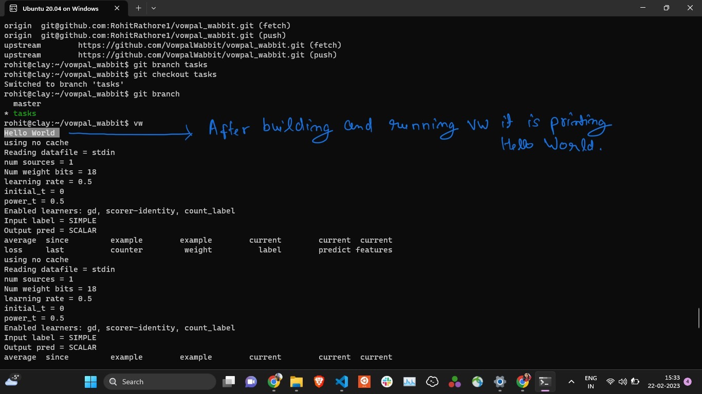

## Exercise 1

For *Exercise 1*: Working with VW - The goal here was to compile VW source code and make a minor modification to it and see that the modification actually worked.  I added the code to VW itself that prints "Hello World" when it runs. 

The steps were following:

Step 1: Clone the VW repository from GitHub:
git clone https://github.com/VowpalWabbit/vowpal_wabbit.git

Step 2: Change the directory to the cloned repository and build the source code:

```
cd vowpal_wabbit

cmake -S . -B build -G Ninja \
    -DCMAKE_BUILD_TYPE:STRING="Release" \
    -DFMT_SYS_DEP:BOOL="ON" \
    -DRAPIDJSON_SYS_DEP:BOOL="ON" \
    -DSPDLOG_SYS_DEP:BOOL="ON" \
    -DVW_BOOST_MATH_SYS_DEP:BOOL="ON" \
    -DVW_GTEST_SYS_DEP:BOOL="ON" \
    -DVW_ZLIB_SYS_DEP:BOOL="ON" \
    -DBUILD_TESTING:BOOL="OFF"

cmake --build build
```

Before building the source code, I made a minor change to the source code to print `Hello World` after running `vw`.  I added the following line to the file `vowpalwabbit/cli/src/main.cc` in the `main` function:

```
int main(int argc, char *argv[])
{
    std::cout << "Hello World" << std::endl;
    vw* all = VW::initialize(argc, argv);
    ...
}
```

Step 3: Run the VW executable and see the output:




## Exercise 2

For *Exercise 2*: Working with Lua - The goal here was to see if I can compile Lua and run a lua script that can interact with a small C++ app.  So, created a simple application with a `main.cpp` (as shown in the [included URL](https://www.geeksforgeeks.org/integrating-lua-in-cpp/)) and run Lua scripts with outputs as specified. 

The steps were following:

Step 1: Download the Lua source code from the official website. At the time of writing this, the latest version of Lua is 5.4.4:

```
wget https://www.lua.org/ftp/lua-5.4.4.tar.gz
```

Step 2: Extract the downloaded file:
```
tar -xvf lua-5.4.4.tar.gz
```

Step 3: Change the directory to the extracted folder and build the source code:

```
cd lua-5.4.4

make linux

make

make test

sudo make install
```

Step 4: Create a simple C++ application with a `main.cpp` file.  The code is as follows:

```
#include <iostream>
#include <lua.hpp>

int main() {
    // Create a Lua state
    lua_State* L = luaL_newstate();

    // Load Lua libraries
    luaL_openlibs(L);

    // Load a Lua script that defines a variable and prints a message
    luaL_dostring(L, "my_variable = 42\n"
                      "print('Hello, Rohit Singh!')\n"
                      "print('The value of my_variable is', my_variable)");

    // Get the value of the 'my_variable' global variable
    lua_getglobal(L, "my_variable");

    // Print the value of the variable
    if (lua_isnumber(L, -1)) {
        int value = lua_tonumber(L, -1);
        std::cout << "The value of 'my_variable' is: " << value << std::endl;
    } else {
        std::cerr << "Error: 'my_variable' is not a number" << std::endl;
    }

    // Change the value of the 'my_variable' global variable in Lua
    lua_pushnumber(L, 84);
    lua_setglobal(L, "my_variable");

    // Print the value of the variable again in C++
    lua_getglobal(L, "my_variable");
    if (lua_isnumber(L, -1)) {
        int value = lua_tonumber(L, -1);
        std::cout << "The new value of 'my_variable' is: " << value << std::endl;
    } else {
        std::cerr << "Error: 'my_variable' is not a number" << std::endl;
    }

    // Close the Lua state
    lua_close(L);

    return 0;
}
```

Step 5: Compile the C++ application:

```
g++ -std=c++11 -o lua_program lua_program.cpp -llua -ldl
```

Step 6: Run the C++ application and the output is as following:


